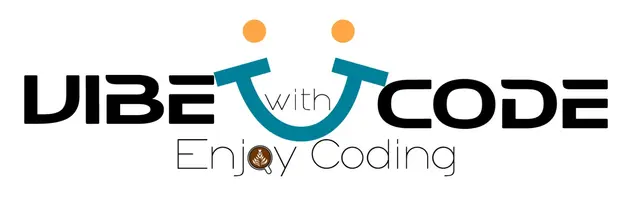

# 🪙 VibeWithCode Algorithm Engine

Welcome to **VibeWithCode**, a sleek, interactive algorithm engine built to solve common programming challenges directly in your browser. Whether you're learning, practicing, or just vibing with code, this engine is your personal playground.



---

## 🔥 Features

✅ 6 algorithm challenges out-of-the-box  
✅ Beautiful dark and light UI toggle  
✅ Each module has its own "Run" and "Refresh" button  
✅ Interactive and responsive layout  
✅ Fully animated and modern design  
✅ Custom WhatsApp contact integration  
✅ Clean code separation: HTML, CSS, and JS are all external

---

## ✨ Modules Included

1. **Fibonacci Sequence**  
   _Generates a sequence up to your desired limit._

2. **Power of Two**  
   _Checks if a number is a power of two._

3. **Capitalize Words**  
   _Capitalizes each word in a sentence._

4. **Number Guessing Game**  
   _Guess a secret number between 1 and 100 with hot/cold feedback._

5. **Shopping Cart Calculator**  
   _Calculates total price from a JSON list of items with discounts and tax._

6. **Payroll Calculator**  
   _Calculates net salary after tax and deductions._

---

## 🌗 Dark / Light Mode

Easily toggle between dark and light mode using the switch at the top right corner.  
Dark mode is the default for a premium vibe 😎.

---

## 📦 Project Structure

```txt
📁 VibeWithCode/
├── index.html         # Main HTML structure
├── st.css             # External CSS styles
├── scr.js             # JavaScript logic and UI interactivity
├── logo.png           # Used in header & footer
└── README.md          # You're reading it 😉
